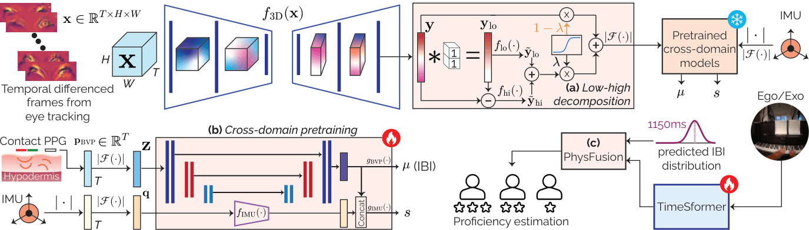

# EgoHRV (ECCV 2026)

### Continuous Heart Rate Variability Estimation from Egocentric Systems for Skill Assessment

[Berken Utku Demirel](), [Christian Holz](https://www.christianholz.net)
**Sensing, Interaction & Perception Lab, ETH Zürich**

[[Project Page](https://siplab.org/projects/EgoHRV)]

> **Code will be available soon.**

## Overview

**EgoHRV** estimates continuous heart rate (HR) and heart rate variability (HRV) directly from the eye-tracking cameras of egocentric headsets. This allows egocentric systems to capture physiological responses related to stress, workload, and engagement without requiring an additional wearable sensor.

<p align="center">
  
</p>

## Key Features

* Continuous HR and HRV estimation from eye-tracking camera views
* Cross-domain pretraining using contact-based physiological signals
* Low–high decomposition for separating cardiac signals from motion interference
* HRV-based physiological features for skill assessment
* Improved proficiency estimation through the fusion of visual and HRV features

---

## Getting Started

The code, pretrained models, and training and evaluation instructions will be available soon.

### Data Preparation

Dataset preparation instructions and preprocessing scripts will be provided with the code release.

## Citation

If you find this work useful, please cite:

```bibtex
@inproceedings{demirel2026egohrv,
  title     = {EgoHRV: Continuous Heart Rate Variability Estimation from Egocentric Systems for Skill Assessment},
  author    = {Demirel, Berken Utku and Holz, Christian},
  booktitle = {European Conference on Computer Vision (ECCV)},
  year      = {2026}
}
```
